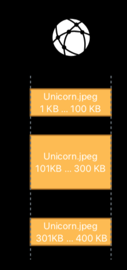
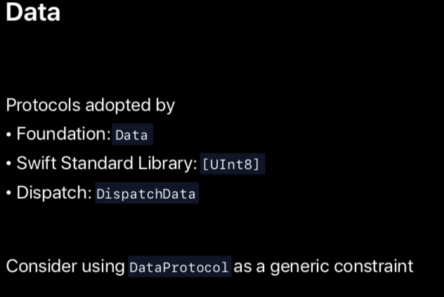
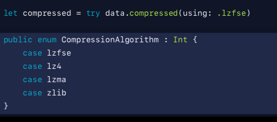
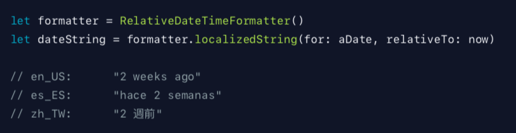
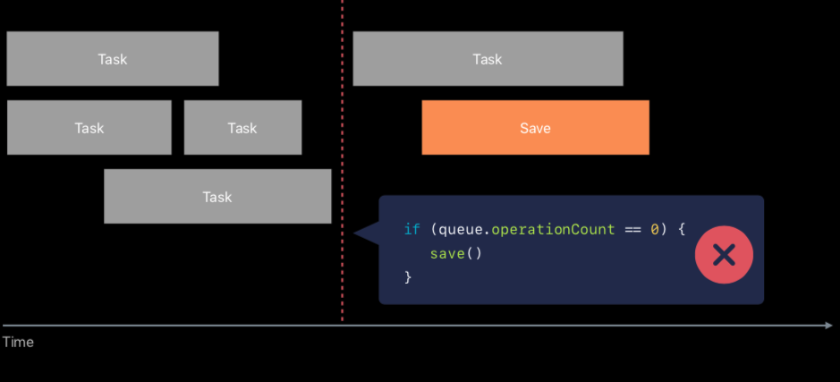
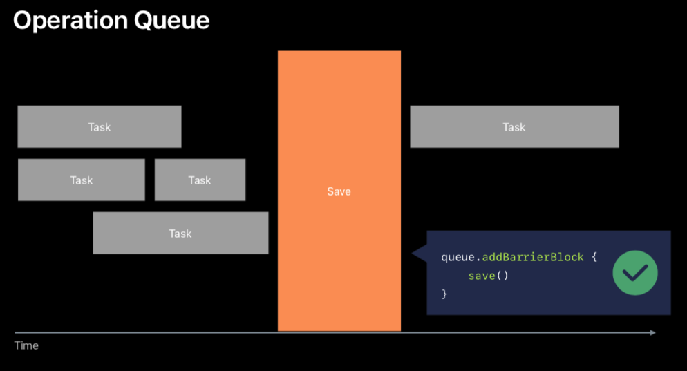
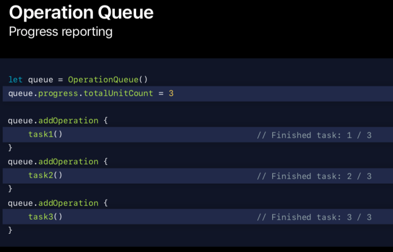

# Advances in Foundation

- Ordered Collection Diffing

- 예시를 들면서 설명시작함
	- [B,E,A,R]에서 [B,I,R,D]가 되고 싶은 컬렉션이 있다.
	- BEAR에는 BIRD가 없는 E,A가 있다.
	- BIRD에는 I,D가 있고..
	- BEAR에서 BIRD가 될 때 2개를 삭제(EA) 하고 2개를(I,D) 삽입한다. (이 때 프레젠테이션에선 B뒤에 I를 R뒤에 D를 자리를 옮기지 않고 삽입하는 것을 보여준다.)
	
- 위의 과정을 `Ordered Collectino Diffing API` 를 통해 쉽게 할 수 있다.

  ```swift
  // contains two insertions and tow removals
  let diff = bird.difference(from: bear)
  
  let newBird = bear.applying(diff) // [b, i, r, d]
  ```

  - String 타입뿐만 아니라 어떤 Collection 타입에도 적용 가능하다.

- Data Contiguity(데이터 접근)에 대해서도 보여줌

  - 예시 : 앱이 만약에 disk로부터 pictures나 다른 타입의 파일들을 만든다고 가정해보자. 보통은 data가 아래와 같이 메모리상에서 contiguous하게 생겼을 것이다.

    

    

  - 반면에 앱이 인터넷으로부터 데이터를 다운받는 경우라면 아래와 같이 생겼을 것이다. 각각 다른 시간에 도착한 여러 데이터 조각들을 표현해준다.

    - (This produces bytes that arrive in multiple chunks in different time, and occupy these contiguous area in memory.)

      

  - 스위프트5 이전에는 struct Data는 contiguous와 discontiguous regions을 표현했다. (위의 두 예시가 struct Data로 표현되었다는 얘기다.) 이렇게 contiguous와 discontigous를 통합해서 보여주는 인터페이스는 사용하기엔(use) 굉장히 심플할 뿐만 아니라 whole buffer에 접근할 수 있도록 해줍니다. > buffer 액세스 부터 무슨말인지 모르겠음... raw bytes에 whole buffer access(접근)을 제공하는데 이렇게 되면 discontigous 한것을 contiguous area에 복사해야하는 것을 필요로 한다.?..일단 더 보자..

    - This unified interface was very simple to use, but it also meant that to provide whole buffer access to the underlying raw bytes, we needed to copy the regions into a contiguous area.

  - 이건 때론 예측 불가한(unpredictable) 퍼포먼스 이슈를 일으 킬 수 있다. 

  - In fact, we have look at real-world usage of data, and every discontiguous data gets flattened  sometime during its lifecycle. > 무슨 말인가요

- 스위프트 5부터는 struct Data는 contiguous buffer type인 것을 보장한다.

  - 문법상으로 이걸 보장하기 위해서 `ContiguousBytes protocol` 이라는게 나옴.
  - 이 프로토콜을 통해서 raw bytes에 대한 접근을 contiguous한 방법으로 하기 때문에 flattening data에 대해 걱정할 필요가 없음.
    - flattening data란

- 잠재적으로 discontiguous type들(contiguous한게 보장되지 않은 타입)에 대해 2가지 프로토콜을 소개함

  - DataProtocol은 다양한 버퍼 타입에 대해 contiguity와 generalizestruct와 독립적으로 Data의 인터페이스를 사용하는 새로운 프로토콜이다.
  - 그리고 MutableDataProtocol도 있는데 추가적으로 mutability에 대한 보장(guarantees)하는 프로토콜이다.
  - Buffer types들은 Foundation에 의해서 제공된다. 그리고 dispatch framework는 이런 프로토콜들을 이미 채택하고 있다. (Data, UInt8, DispatchData 등등..)

  

> 여기 부분 정말 이해하기 좀 어려움...


- 압축(Compression)에 대해 얘기해보려함.

  

  - 요런 심플한걸로(한줄의 코드) 데이터를 쉽게 압축할 수 있다. (박수 받음..ㅋㅋㅋ)
  - 저기에 나온 알고리즘이 무손실 알고리즘이라는걸 알면 당연히 박수가 나올것임...알고리즘을 그냥 선택해서 알아서 압축해준다.

- Units(단위)에 대해 얘기해보려함.

  - UnitDuration에 `milliseconds, microseconds, nanoseconds, picoseconds` 가 추가되었음.
  - UnitFrequency에 `framesPerSeconds` 가 추가 되었음.
  - 그 외에도 `UnitInformationStorage`에 변경사항이 생김..

- Displaying a Date or Time

  - 모든 locale에 대해 정확하게 표현하는것에 대한 귀찮은(tirivial) 짓을 많이 했어야 했다.

  - `RelativeDateTimeFormatter` 가 생겨버림..짱좋음..

    

  - ListFormatter도 나 > 리스트 조인할때 localize사용할 수 있음.

  - 요번 설명은 예제 소스코드설명 보는게 훨씬 빠르다.

- OperationQueue

  - 만약에 여러 태스크가 백그라운드에서 concurrent하게 돌아가고 있는데 현재 state를 저장하기 원한다면 보통은 기존 방식으로 이렇게 할지도 모른다.

  - running operations를 체크하는 경우... 이렇게 하지말라고 한다.. Please don't do this.ㅋㅋㅋ왠지 진짜 하지 말아야될거같은 느낌..
- 왜냐하면 요런 상황 때문에... 만약에 if문에서 체크하고나서 save하는 그 순간 찰나에 task가 런닝될수도있는 위험한 상황이 발생할 수 있다.
  
  

  - 그럼 어떡하라구?  이렇게 하라구 > `Barrier`를 지원한다.

    


- Operation Queue의 Progress reporting이라는게 생김

  


- USB and SMB의 파일 다루기 on iOS

  - Multiple Volumes : Use `FileManager.SearchPathDirectory.itemReplacementDirectory`
  - Disappearing volumes : Use `Data.ReadingOptions.mappedIfSafe`

- Swift Update - Scanner

  ```swift
  // Swift 4
  var nameNSString: NSString?
  if scanner.scanUpToCharacters(from: .newlines, into: &nameNSString) {
  let name = nameNSString! as String }
  
  // Swift 5.1
  let nameString = scanner.scanUpToCharacters(from: .newlines)
  let matchedString = scanner.scanString(string: "hi, 👀")
  ```

  

- FileHandle

  - Error-based API 나옴

  ```swift
  let fileHandle = FileHandle()
  let data = try fileHandle.readToEnd()
  ```

  - Works with DataProtocol

  ```swift
  extension FileHandle {
  public func write<T: DataProtocol>(contentsOf data: T) throws
  }
  ```


#### Try it

- Use DataProtocol instead of [UInt8]
- Format dates and lists with Formatter
- Use OperationQueue’s barrier and progress reporting