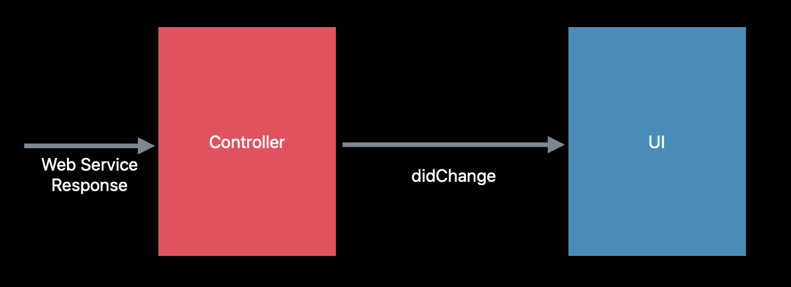

# Advances in UIDataSource

- 세션영상
    - [https://developer.apple.com/videos/play/wwdc2019/220/](https://developer.apple.com/videos/play/wwdc2019/220/)

### Current State-of-the-art

```swift
// MARK: UICollectionViewDataSource
func numberOfSections(in collectionView: UICollectionView) -> Int { ... }
func collectionView(_ collectionView: UICollectionView,
										numberOfItemsInSection section: Int) -> Int { ... }
func collectionView(_ collectionView: UICollectionView,
										cellForItemAt indexPath: IndexPath) -> UICollectionViewCell { ... }
```


- 단순함 / 유연함 Simple, Flexible

... 

> 앱은 점점 복잡해짐(UI)

- 복잡함 정도에 따라 무거워지는 Controllers
- Web Services
- DB

### 동작 순서

1. `Controller` 에게 `numberOfItemsInSection` 을 통해 필요한 사항을 요구


2. `Controller` 는 요청받음에 따라 보여줄 데이터를 서버,DB등을 통하여 전달받아 UI적용(알려준다)



3. 데이터를 갱신 시킬 때 다음과 같은 에러를 종종 마주치게된다.

*** Terminating app due to uncaught exception 'NSInternalInconsistencyException', reason: 'Invalid update: invalid number of sections. The number of sections contained in the collection view after the update(10)
...
(0 inserted, 1deleted). ***

- 이때  종종 `reloadData()` 를 통해 해결하지만 때로는 최고의 해결책은 아님,
- 현재와 같은 API(기존방식)은 복잡한 요구사항에서 에러가 일어나기 쉬운 상태이다.

### Diffable Data Source

- `performBatchUpdates()` 에러를 발생시킴, 복잡함 
- `apply()` 쉽고 자동으로 diffing

---

- **iOS, tvOS**
    - `UICollectionViewDiffableDataSource`
    - `UITableViewDiffableDataSource`
- **MacOS**
    - `NSCollectionViewDiffableDataSource`
- **All Platform**
    - `NSDiffableDatasourceSnapshot`

### Snapshots

- UI의 현재상태를 나타냄
- sections와 items의 고유한 식별자(identifier)로 활용

### Constructing Snapshot

- **Empty snapshot**

    ```swift
    let snapshot = NSDiffableDataSourceSnapshot<Section, UUID>()
    ```

- **current data source snapshot copy**

    ```swift
    let snapshot = dataSource.snapshot()
    ```

- **Snapshot State**

    ```swift
    var numberOfItems: Int { get }
    var numberOfSections: Int { get }
    var sectionIdentifiers: [SectionIdentifierType] { get }
    var itemIdentifiers: [ItemIdentifierType] { get }
    ```

- **Configuring Snapshots**

    ex) 기존: 해당 IndexPath위치에 더해줘

    ​      변경: 해당 identifier 앞에 더해줘 
    
    ```swift
    func insertItems(_ identifiers: [ItemIdentifierType],
    								beforeItem beforeIdentifier: ItemIdentifierType)
    func moveItem(_ identifie: ItemIdentifierType,
    							afterItem toIdentifier: ItemIdentifierType)
    func appendItems(_ identifiers: [ItemIdentifierType],
    								toSection sectionIdentifier: SectionIdentifierType? = nil)
    func appendSections(_ identifiers: [SectionIdentifierType])
    ```

### 실행과정

1. 스냅샷을 생성
2. 스냅샷을 apply하여 UI에 대한 변경사항을 자동으로 커밋
3. DiffableDataSource는 diffing을 처리하고 UI요소의 변경사항을 실행한다.
    1. UI가 갱신 되는 동안 어떠한 조치를 취할 필요가 없다. 시스템에 위임

### Identifiers

- Unique
- Hashable
    - Enum 데이터 모델은 자동으로 Hashable을 채택하고 있음.
- Data model or identifier ?
- 식별자는 Int, String, UUID 타입 사용가능

**Custom Identifiers**

```swift
struct MyModel: Hashable {
	let identifier = UUID()
	func hash(into hasher: inout Hasher) { 
		hasher.combine(identifier)
	}
	static func ==(lhs: MyModel, rhs: MyModel) -> Bool { 
		return lhs.identifier == rhs.identifier
	}
}
```

### What about IndexPath-based APIs?

- IndexPath 기반 API들은 어떻게 사용하는가

    ```swift
    func collectionView(_ collectionView: UICollectionView,  didSelectItemAt indexPath: IndexPath) {	if let identifier = dataSource.itemIdentifier(for: indexPath) { 	// do something..	}}
      // DiffableDataSource에서 제공하는 함수를 활용
      func itemIdentifier(for indexPath: IndexPath) -> ItemIdentifierType?
    
    ```

### Performance

- Fast
- apply()함수는 background queue 에서도 안전하고, 성능을 보장하기 때문에 상황을 고려하여 활용가능